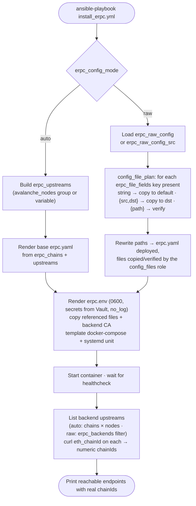

# Ansible Role: eRPC

Deploy an [eRPC](https://docs.erpc.cloud/) fault-tolerant EVM RPC proxy/cache
with Docker Compose. A single playbook (`install_erpc.yml`) runs in two modes,
selected by `erpc_config_mode`, and in both prints the exact endpoint(s) eRPC
exposes — with their real numeric chainIds — at the end of the run.

| `erpc_config_mode` | What it does |
|--------------------|--------------|
| `auto` (default) | Generates a base `erpc.yaml` from `erpc_upstreams` / `erpc_chains` (`erpc_upstreams` defaults to the `avalanche_nodes` group). |
| `raw`  | Deploys **your** `erpc.yaml` verbatim (`erpc_raw_config` mapping or `erpc_raw_config_src` file), only wiring up secrets and files. |

Set the mode in your inventory (e.g. `group_vars`); the default is `auto`.
Requires the `geerlingguy.docker` role (applied by the playbook).

## Flow



## How secrets are handled (never in clear)

Secrets are **never** written into `erpc.yaml`. In your config you reference them
as `${VAR}`; eRPC interpolates them from the container environment at runtime.

- Put the **values** in an Ansible Vault and expose them via `erpc_secret_env`.
- They are rendered only to `{{ erpc_conf_dir }}/erpc.env` (mode `0600`, root).
- The task rendering that file runs with `no_log: true` — nothing leaks to logs.

```yaml
# group_vars/erpc/vault.yml   (ansible-vault encrypted)
erpc_secret_env:
  ALCHEMY_API_KEY: "real-secret"
  REDIS_PASSWORD: "real-secret"
```

```yaml
# in your erpc.yaml (raw mode)
upstreams:
  - endpoint: "alchemy://${ALCHEMY_API_KEY}"
```

## How files are handled

Some eRPC keys reference files that must physically exist next to the binary
(they cannot pass through env vars). `erpc_file_fields` (see `defaults/main.yml`)
declares those keys and a **default host path** for each. For every declared key
that is present in your config, the **value** decides what happens — and is
rewritten so the deployed `erpc.yaml` is valid on the host; the file is then
mounted into the container at its final host path:

| Value in the config | Behaviour | Final value |
|---------------------|-----------|-------------|
| plain string | copy that **controller** path to the field's default `dest` | `dest` |
| `{ src, dst }` | copy `src` (controller) to `dst` (overrides the default) | `dst` |
| `{ path }` | copy nothing; **verify** `path` exists on the host (file present / dir non-empty) | `path` |
| anything else | the run **fails** | — |

```yaml
erpc_raw_config:
  server:
    tls:
      certFile: "{{ inventory_dir }}/../files/erpc/server.crt"   # → copied to default path
      keyFile: { src: "/local/secret/server.key", dst: "/etc/ssl/erpc.key" }  # → copied to dst
      caFile: { path: "/etc/ssl/certs/internal-ca.crt" }          # → must already exist on host
```

Declared keys by default: `server.tls.{certFile,keyFile,caFile}`,
`database…connectors[].redis.tls.{certFile,keyFile,caFile}` and
`database…connectors[].dynamodb.auth.credentialsFile`. Add your own by extending
`erpc_file_fields`.

This is powered by two reusable pieces, usable from any role:

- the **`config_file_plan` filter** — turns `(config, fields)` into a rewritten
  config plus a list of copy/verify operations;
- the **`ash.avalanche.config_files` role** — executes that plan (creates dirs,
  copies files/dirs, verifies required paths).

## Key variables

See `defaults/main.yml` for the full list.

```yaml
erpc_version: "0.0.64"
erpc_config_mode: auto          # auto | raw
erpc_conf_dir: /etc/erpc
erpc_http_port: 4000
erpc_metrics_port: 4001

# raw mode
erpc_raw_config: {}             # native YAML mapping (preferred)
erpc_raw_config_src: ""         # or a path to an erpc.yaml on the controller
erpc_file_fields: [...]         # declared file keys + default host paths

# auto mode
erpc_project_id: main
erpc_upstreams: []              # base RPC URLs
erpc_chains:                    # AvalancheGo blockchain IDs/aliases
  - C
erpc_backend_ca_file: ""        # CA for self-signed backends (SSL_CERT_FILE)
```

## Endpoints printed at the end

In **both** modes the role enumerates the backend upstreams and queries each one
for its `eth_chainId`, so the summary shows the **real numeric chainIds** and the
exact reachable routes. The route form is the root `/<chainId>` when a wildcard
alias serves the project at `/`, otherwise the canonical `/<project>/evm/<chainId>`.

- **auto**: upstreams are `erpc_chains × erpc_upstreams`.
- **raw**: upstreams are read from the deployed config (`erpc_backends` filter).

```
eRPC is up (raw mode).
Healthcheck: http://<host>:4000/healthcheck
Metrics: http://<host>:4001/metrics
Available chainIds: 43114, 18504
Endpoint: http://<host>:4000/43114
Endpoint: http://<host>:4000/18504
```

If a backend can't be reached (e.g. a self-signed cert eRPC trusts but the
query doesn't), the role warns and tells you to set `erpc_backend_validate_certs:
false` or point `erpc_backend_ca_file` at the signing CA.
